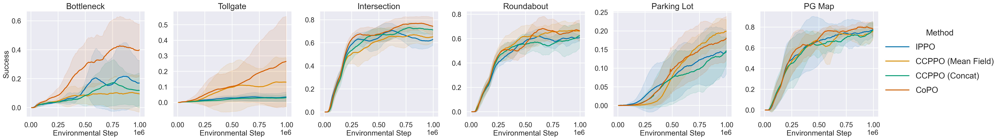
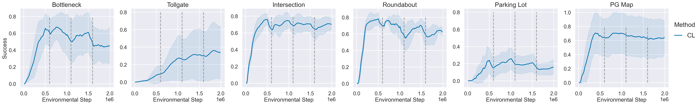
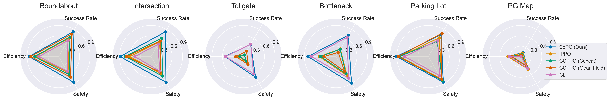

# MetaDrive Multi-agent Environment Benchmark Results

* MetaDrive version: [0.2.5](https://github.com/metadriverse/metadrive/tree/releases/0.2.5)
* Training code: [CoPO repo](https://github.com/decisionforce/CoPO)
* Related project: [CoPO webpage](https://decisionforce.github.io/CoPO/)

## Training Results

Learning curve:

Success rate table:

|                    | Bottleneck    | Tollgate      | Intersection   | Roundabout   | Parking Lot   | PG Map        |
|:-------------------|:--------------|:--------------|:---------------|:-------------|:--------------|:--------------|
| IPPO               | 24.04 (18.74) | 4.41 (2.56)   | 71.91 (5.27)   | 66.43 (4.99) | 16.98 (5.90)  | 81.81 (6.50)  |
| CCPPO (Concat)     | 19.55 (15.80) | 3.53 (1.92)   | 75.67 (3.18)   | 67.82 (4.09) | 12.01 (7.52)  | 80.21 (3.58)  |
| CCPPO (Mean Field) | 14.60 (11.24) | 14.86 (16.47) | 70.79 (6.29)   | 71.03 (5.45) | 20.66 (3.47)  | 79.56 (3.92)  |
| CL                 | 60.60 (22.18) | 37.29 (30.65) | 75.68 (6.24)   | 72.28 (5.45) | 21.26 (10.15) | 71.16 (23.69) |
| CoPO               | 47.39 (19.49) | 27.19 (25.63) | 79.47 (4.97)   | 72.82 (6.73) | 19.51 (5.59)  | 83.40 (3.13)  |

> **Note**
> The success rate here is computed as follows: for each algo and each env, we compute the maximum training success rate
> for each random seed. Please note that we need to discard training record of CL in the first 1.5M steps before computing
> the success rate. This is because in the first three stages of CL, the environment is much easier than it should be and
> thus the training rate at that time is not accurate.

## Radar Figure

The evaluation results when we run IPPO, CCPPO and CoPO:

> **Note**
> Curriculum Learning evaluationg results are not included since we only save the top 5 checkpoints according to the *training success rate*. However, this leads to poor evaluate results since the best training success rate happens in the begining of CL training but the checkpoints at that time have poor generalizability in the "full" environment. You should probabily run `train_all_cl.py` with the argument `keep_checkpoints_num` set to None.

## Training, Evaluation and Plotting Scripts

We run 5 algorithms in 6 multi-agent environments. Each experiment is repeated 8 times. The training scripts are provided in:  https://github.com/decisionforce/CoPO/tree/main/copo_code/copo

Evaluation script is provided in:  https://github.com/decisionforce/CoPO/blob/main/copo_code/copo/eval.py

Please refer to [CoPO repo](https://decisionforce.github.io/CoPO/) for more information in training and evaluation.

To draw learning curves and get the performance table, please refer to `Process and plot training results.ipynb` notebook.
If you want to parse the data generated by your own experiments, please refer to `Preprocess training data.ipynb` notebook.

To draw evaluation results, please refer to `Process and plot evaluation results.ipynb` notebook.

## Data

The compressed evaluation results that you can use to draw figure are provided in: https://github.com/metadriverse/metadrive-benchmark/releases/download/asset-marl/formal_evaluate_results.zip

The compressed training log that you can use to draw learning curves are provided here: 
https://github.com/metadriverse/metadrive-benchmark/releases/download/asset-marl/training_curves.zip

Due to the huge volume of the training results, we can not provide the raw training results and intermediate checkpoints.

## Best checkpoints

We provide the best checkpoints for each environment and each algorithm in:  https://github.com/metadriverse/metadrive-benchmark/releases/download/asset-marl/new_best_checkpoints.zip
 
Given the evaluation results CSV file, you can find your best checkpoint by following the code in `Find the best checkpoint.ipynb`. 
Please refer to this file in CoPO repo for the code to run the checkpoints:  https://github.com/decisionforce/CoPO/blob/main/copo_code/copo/new_vis.py

## Reference

Please cite MetaDrive paper via: https://github.com/metadriverse/metadrive#-references

Please cite CoPO paper via: https://github.com/decisionforce/CoPO#citation
